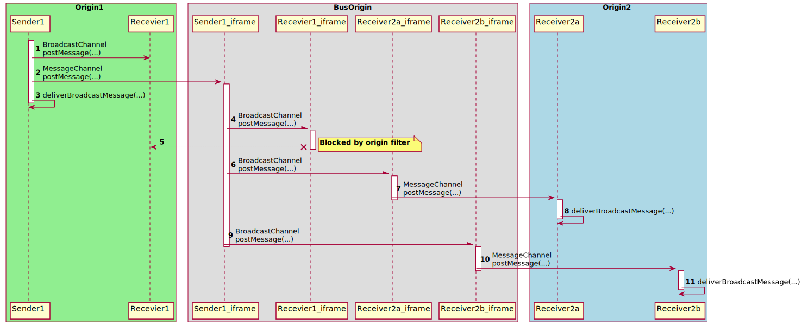
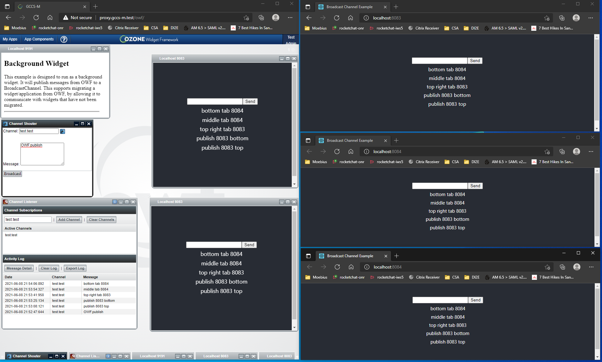
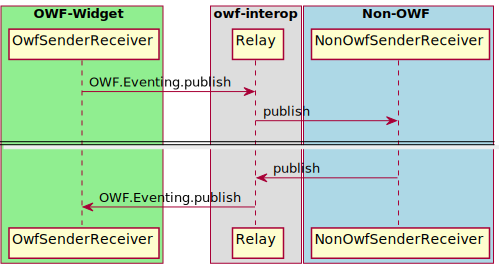

# inter-widget-communication

The `inter-widget-communication` library is an npm library providing a simple wrapper around and replacement for the ready, publish, subscribe, and unsubscribe functions of OWF. This library is intended to ease the transition away from OWF by providing a replacement for direct calls to OWF that will function inside or outside OWF. It is not intended as a complete replacement for OWF; OWF capabilities unrelated to OWF's ready, pub and sub are outside the scope of this library.

The library exposes a single class, `IWC`. `IWC` contains the following methods:
* `subscribe`: Subscribes to the topic provided. In OWF, this this is a thin wrapper around `OWF.Eventing.subscribe` with the same signature. Outside OWF, this will utilize Ozone's `ozp-iwc` client library to watch a node on `ozp-iwc`'s bus library. 
* `unsubscribe`: Unsubscribes a widget from recieving events from the provided topic. In OWF, this this is a thin wrapper around `OWF.Eventing.unsubscribe` with the same signature. Outside OWF, this will unwatch a node from the `ozp-iwc`. 
* `publish`: Publishes data to the given topic. In OWF, this this is a thin wrapper around `OWF.Eventing.publish` with the same signature. Outside of OWF, this will utilize the create or update a node on the communication bus. 
* `ready`: Fires the callback function when messaging is set up. In OWF, this this is a thin wrapper around `OWF.Eventing.ready` with the same signature Outside of OWF, the callback function fires after establishing the `ozp-iwc` bus and client. 

Setting up the IWC client
* Download the latest IWC [release](https://github.com/ozoneplatform/ozp-iwc/releases) and copy the client library into your widget's project and refer to it with the script tag.
```html
 <script src="<relative pathing for project>/ozpIwc-client.min.js"></script>
```
* Create a IWC client. In your application's javascript instantiate a new ozpIwc.Client. The peerUrl is the path to the hosted bus, grunt serve hosts an example bus locally on port 13000.
 ```html
 var client = new ozpIwc.Client({ peerUrl: "http://localhost:13000"});
```
* When creating the iwc object, pass the ozpIwc client
 ```html
const iwc = new IWC(client);
```

# Function Based Interface

A simpler API was added. 
The above API still works.
However, with the added API functions, clients do not need to manage the `IWC` instance.
Also, `publish` and `subscribe` are wrapped in `ready`, so they can be called
without having to wrap them in a `ready` call.

Example usage:

```typescript
import { initialize } from '@gohypergiant/inter-widget-communication'

const myId = initialize({
  provider: 'broadcast',
  busUrl: 'http://bus-host/bus/js'
})

subscribe('topic', (sender, message) => { ... })

publish('topic', 'message'))
```

# Getting Started (`ozp-iwc` Implementation)

## Sample `iwc-bus`

For testing purposes, you can use the `iwc-bus`.
Below will run a server on port `9090`.

```
cd iwc-bus
npm install
npm start
```

## Sample `iwc-example`

This example shows how to `initialize` the IWC and `publish` and `subscribe`.
After starting the HTTP server, you can visit `http://localhost:8080`.
You should see a text field with a `send` button next to it.
This will publish a message on the `test.test` topic.
Below the text field you will send any messages we receive on the `test.test` topic
(including the ones this page publishes).

Run the server:

```
cd iwc-example
npm install
npm run build
npm run serve
```

If you open a second terminal window, you can run

```
npm start
```

And a second server will be running on the next available port.
For example, `http://localhost:8081`.
> Note that this is not considered the "Same Origin" as `http://localhost:8080`.
Therefore if messages pass between the two pages, you have an example of
working around the "Same Origin" restriction that `BroadcastChannel`s impose.

# Detailed Client Instructions

The sample client built using these instructions is here: `inter-widget-communication/iwc-example`.

Clients can use `ozp-iwc` by installing the required dependencies:

```
npm install @gohypergiant/inter-widget-communication
npm install @gohypergiant/ozp-iwc
```

Then in `package.json`, copying the `ozpIwc-client` files to where static assets will be served.

```json
"scripts": {
    ...
    "copy": "copyfiles --up 5 node_modules/@gohypergiant/ozp-iwc/dist/js/* public/js/ozp-iwc-1.2.4",
    ...
}
```

Then running

```
npm run copy
```

Then adding in `index.html`

```html
<head>
    ...
    <script src="js/ozp-iwc-1.2.4/ozpIwc-client.js"></script>
    ...
</head>
```

Then in `index.tsx` or initial JavaScript/Typescript entry, adding

```typescript
import { initialize } from '@gohypergiant/inter-widget-communication'

const myId = initialize({
  busUrl: 'http://localhost:9090/ozp-iwc-1.2.4'
})
```

And finally, where needed `publish` or `subscribe`:

```typescript
  function handleSend(evt: React.FormEvent) {
    evt.preventDefault()

    const input = inputRef.current as HTMLInputElement
    publish('test.test', input.value)
    input.value = ''
  }
```

```ts
  React.useEffect(() => {
    subscribe('test.test', (sender: string, msg: string) => {
      console.log('sender:', sender, 'msg: ', msg)
      setLastFive(a => [msg, ...a].slice(0, 5))
    })
  }, [])
```

# HTML5 `BroadcastChannel`/`MessageChannel` Implementation

This implementation is a good candidate to replace the `ozp-iwc` implementation 
because most of the implementation is provided by the browser.

## Cross-Origin Support

You can deploy `bcst-bus` and set `busUrl` to the reachable URL for `bcst-bus`.
All pages that use the same `busUrl` will be able to exchange messages.
## `BroadcastChannel`/`MessageChannel` Cross Origin Sequence Diagram



## `OWF`/`BroadcastChannel` Interop

When using `inter-widget-communication`,
we can addon OWF/BroadcastChannel inter-operation by creating a background widget hosting the `bcst-owf-interop`.
You can deploy `bcst-owf-interop`. 
When this widget is running, subscriptions created with the `subscribe` function will also subscribe to the same OWF channel.
Furthermore, `publish` will also publish on the same OWF channel.
This means that an OWF widget that is not using this facade library for IWC can exchange
messages with users of this library, including pages that are running outside of OWF
and pages that are "Cross Origin".

> Note: the `busUrl` is currently hard-code to `localhost:9090`.
> Hopefully, this will be addressed soon.

In this screenshot, you can see the older OWF test widgets, Channel Shouter and Channel Subscripts
are publishing and receiving messages to/from OWF and to/from this `IWC` facade.



# `OWF`/`BroadcastChannel` Interop Sequence Diagram



